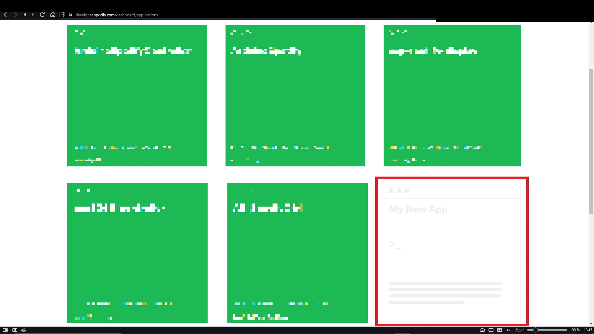
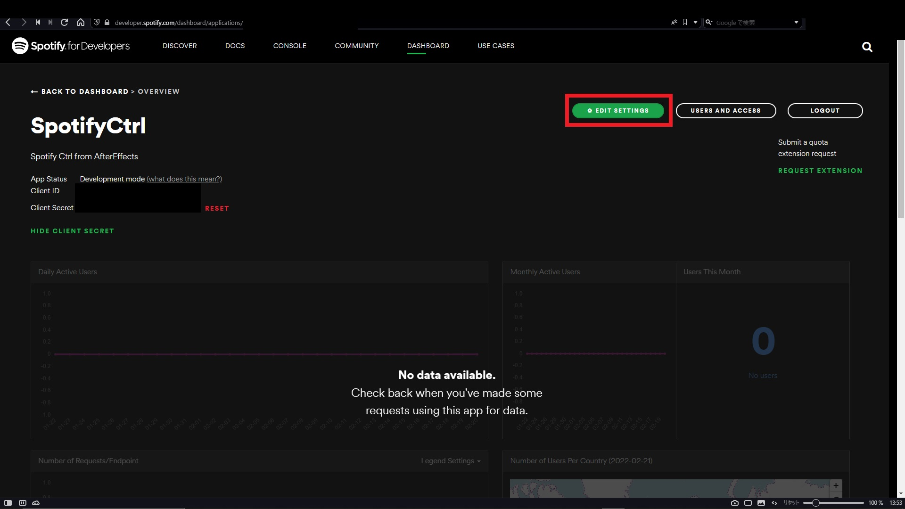

## APIキー取得

まず初めに[Spotify For Developers](https://developer.spotify.com/dashboard/login)へアクセスし **Login** からログインしてください。

After logging in, select **My New App** from the dashboard to create an API key for your new application.

**CREATE AN APP** dialog will open, set **App name** and **App description**.

This setting can be set to your preference.

After agreeing to the terms of use and clicking **CREATE**, the following over view will be opened, and you can open **EDIT SETTING**.

Enter the following URL in **Redirect URIs** and click **ADD**.

    http://localhost:18647/callback
    

After adding the settings, scroll down to the bottom and click **SAVE** to save the settings.

Next, add the **Client ID** and **Client Secret** in the upper left corner of the page to the plugin.

Each of these should be entered on the plugin side.

When you click the OK button on the plugin side, an authentication screen will appear in your browser, and you can approve the settings.
