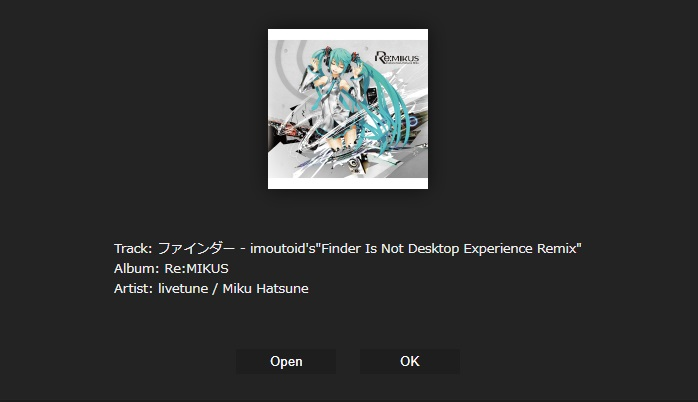
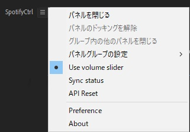
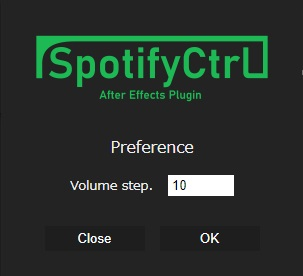

## How to use

  

### Main window

The operation is the same as for the official Spotify client software.

From left to right: mute, volume down, shuffle, previous song, play/stop, next song, repeat, volume up, and show song information.

The volume slider is located below the buttons.

### Song information

  

You can display information about the currently playing song.

Songs in local files cannot be displayed.

### Menu

  

You can open the menu from the menu icon in the upper left corner (the icon with three lines)

#### Use volume slider

The volume slider can be turned on or off.

#### Sync status

You can synchronize the operations of other client software with those of the plug-in.

#### API Reset

This function allows you to reset the API information set in the plugin.

Please use this function when some problems occur.

#### Preference

  

You can make various settings.

##### Volume step

You can set the amount of volume to be performed by the volume up and down buttons.

#### About

Information about the plugin will be displayed.
