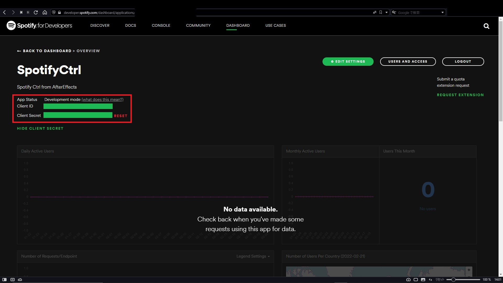
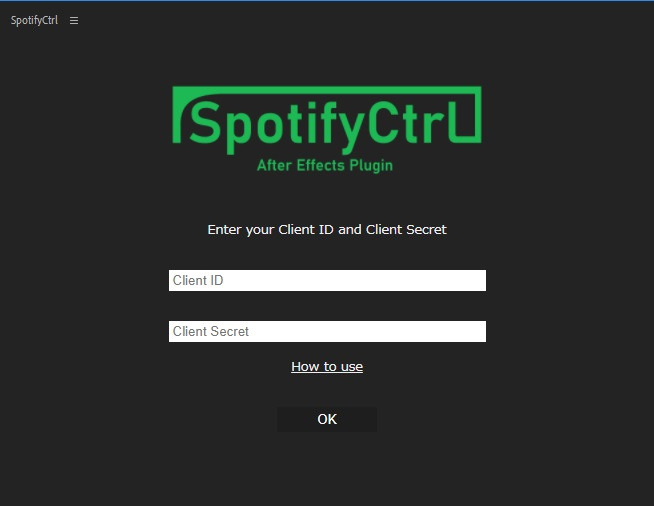

## APIキー取得

まず初めに[Spotify For Developers](https://developer.spotify.com/dashboard/login)へアクセスし **Login** からログインしてください。

ログイン完了後ダッシュボードから **My New App** を選択し新しいアプリケーション用APIキーを作成します。

**CREATE AN APP** ダイアログが開かれるので **App name** と **App description** を設定します。

この設定はお好みの設定で構いません。

利用規約に同意し **CREATE** をクリックしたら以下のようなオーバービューが開かれるので **EDIT SETTING** を開きます。

**Redirect URIs** に以下のURLを入力し **ADD** をクリックしてください。

    http://localhost:18647/callback
    

追加したら下までスクロールし **SAVE** で設定を保存します。

次にページ左上にある **Client ID** と **Client Secret** をプラグインに追加します。

それぞれプラグイン側に入力してください。

プラグイン側のOKボタンをクリックするとブラウザで認証画面が表示されるので、承認して設定完了です。
