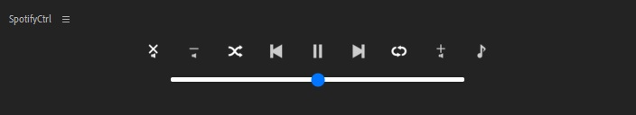

## 操作方法

  

### メインウィンドウ

操作方法は通常のSpotify公式クライアントソフトと同様です。

左から ミュート、音量ダウン、シャッフル、前の曲、再生/停止、次の曲、リピート、音量アップ、楽曲情報表示 です。

ボタン下部に音量スライダーが設置されています。

### 楽曲情報表示

  

現在再生されている楽曲情報を表示できます。

ローカルファイルの楽曲は表示できません。

### メニュー

  

左上のメニューアイコン(三本線が並んだアイコン)からメニューを開くことが出来ます

#### Use volume slider

ボリュームスライダーのオン、オフが可能です。

#### Sync status

他のクライアントソフトで操作した後、その操作をプラグイン側に同期することが出来ます。

#### API Reset

プラグイン側で設定したAPI情報をリセットできます。

何らかの不具合が生じた場合に使用してください。

#### Preference

  

各種設定が出来ます。

##### Volume step

音量アップ、ダウンボタンで行うボリュームの加減を設定できます。

#### About

プラグインの情報が表示されます。
